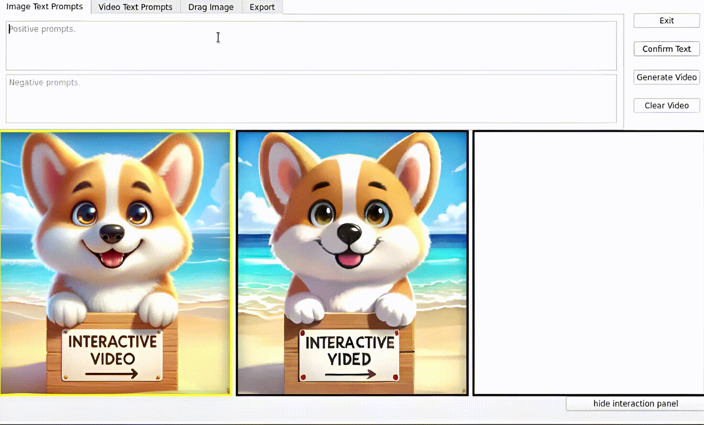

## ___***InteractiveVideo: User-Centric Controllable Video Generation with Synergistic Multimodal Instructions***___

<p align="center" width="100%">

</p>

[](xxx)
[](https://invictus717.github.io/InteractiveVideo-Dev/)
[](https://discord.gg/vm9AJByvej)
<a target="_blank" href="https://huggingface.co/spaces/Yiyuan/InteractiveVideo">
  
</a>


## 🔆 Introduction


*InteractiveVideo* is a user-centric framework for interactive video generation. It highlights the contributions of comprehensive editing by users' intuitive manipulation, and it performs high-quality regional content control and precise motion control. We would like to introduce features as follows:

### 1. Personalize A Video

<table class="center">
  <td></td>
  <td></td>
  <td></td>
  <tr>
  <td style="text-align:center;" width="210">"Purple Flowers."</td>
  <td style="text-align:center;" width="210">"Purple Flowers, bee"</td>
  <td style="text-align:center;" width="210">"the purple flowers are shaking, a bee is flying"</td>
  <tr>
</table >

<table class="center">
  <td></td>
  <td></td>
  <td></td>
  <tr>
  <td style="text-align:center;" width="210">"1 Cat."</td>
  <td style="text-align:center;" width="210">"1 Cat, butterfly"</td>
  <td style="text-align:center;" width="210">"the small yellow butterfly is flying to the cat's face"</td>
  <tr>
</table >

### 2. Fine-grained Video Editing 

<table class="center">
  <td></td>
  <td></td>
  <td></td>
  <tr>
  <td style="text-align:center;" width="210">"flowers."</td>
  <td style="text-align:center;" width="210">"flowers, bee"</td>
  <td style="text-align:center;" width="210">"windy, the flowers are shaking in the wind"</td>
  <tr>
</table >

<table class="center">
  <td></td>
  <td></td>
  <td></td>
  <tr>
  <td style="text-align:center;" width="210">"1 Man."</td>
  <td style="text-align:center;" width="210">"1 Man."</td>
  <td style="text-align:center;" width="210">"1 Man, smiling."</td>
  <tr>
</table >

### 3. Powerful Motion Control

*InteractiveVideo* can perform precise motion control.

<table class="center">
  <td></td>
  <td></td>
  <td></td>
  <tr>
  <td style="text-align:center;" width="210">"1 man, dark light "</td>
  <td style="text-align:center;" width="210">"the man is turning his body"</td>
  <td style="text-align:center;" width="210">"the man is turning his body"</td>
  <tr>
</table >

<table class="center">
  <td></td>
  <td></td>
  <td></td>
  <tr>
  <td style="text-align:center;" width="210">"1 beautiful girl with long black hair, and a flower on her head, clouds"</td>
  <td style="text-align:center;" width="210">" the girl is turning gradually"</td>
  <td style="text-align:center;" width="210">" the girl is turning gradually"</td>
  <tr>
</table >

### 4. Characters Dressing up 

*InteractiveVideo* can smoothly cooperate with LoRAs and DreamBooth, thus, there are many potential functions of this framework that are still under-explored. 

<table class="center">
  <td></td>
  <td></td>
  <td></td>
  <tr>
  <td style="text-align:center;" width="210">"Yae Miko" (Genshin Impact)</td>
  <td style="text-align:center;" width="210">"Dressing Up "</td>
  <td style="text-align:center;" width="210">"Dressing Up"</td>
  <tr>
</table >

<!-- ## 📝 News
- __[2024.02.xx]__: Release [InteractiveVideo](https://arxiv.org/abs/2310.19512) Demo Video. -->

## ⚙️ Quick Start

### 1. Install Environment via Anaconda
```bash
# create a conda environment
conda create -n ivideo python=3.10
conda activate ivideo

# install requirements
pip install -r requirements.txt
```

### 2. Prepare Checkpoints

You can simply use the following script to download checkpoints
```bash
python scripts/download_models.py
```
This will take a long time, you can also selectively download checkpoints by modifying "scripts/download_models.py" and "scripts/*.json". Please make sure that there is at least one checkpoint left for each JSON file. Moreover, all checkpoints are listed as follows

1. Checkpoints for enjoying image-to-image generation

|Models|Types|Version|Checkpoints|
|:---------|:---------|:---------|:--------|
|StableDiffusion|-|v1.5|[Huggingface](https://huggingface.co/runwayml/stable-diffusion-v1-5)
|StableDiffusion|-|turbo|[Huggingface](https://huggingface.co/stabilityai/sd-turbo)
|KoHaKu|Animation|v2.1|[Huggingface](https://huggingface.co/KBlueLeaf/kohaku-v2.1)
|LCM-LoRA-StableDiffusion|-|v1.5|[Huggingface](https://huggingface.co/latent-consistency/lcm-lora-sdv1-5)
|LCM-LoRA-StableDiffusion|-|xl|[Huggingface](https://huggingface.co/latent-consistency/lcm-lora-sdxl)

2. Checkpoints for enjoying image-to-video generation

|Models|Types|Version|Checkpoints|
|:---------|:---------|:---------|:--------|
|StableDiffusion|-|v1.5|[Huggingface](https://huggingface.co/runwayml/stable-diffusion-v1-5)
|PIA (UNet)|-|-|[Huggingface](https://huggingface.co/Leoxing/PIA/tree/main)
|Dreambooth|MagicMixRealistic|v5|[Civitai](https://civitai.com/api/download/models/82446)
|Dreambooth|RCNZCartoon3d|v10|[Civitai](https://civitai.com/api/download/models/71009)
|Dreambooth|RealisticVision|-|[Huggingface](https://huggingface.co/frankjoshua/realisticVisionV51_v51VAE)


3. Checkpoints for enjoying dragging images.

|Models|Types|Resolution|Checkpoints|
|:---------|:---------|:---------|:--------|
|StyleGAN-2|Lions|512 x 512|[Google Storage](https://storage.googleapis.com/self-distilled-stylegan/lions_512_pytorch.pkl)
|StyleGAN-2|Dogs|1024 x 1024|[Google Storage](https://storage.googleapis.com/self-distilled-stylegan/dogs_1024_pytorch.pkl)
|StyleGAN-2|Horses|256 x 256|[Google Storage](https://storage.googleapis.com/self-distilled-stylegan/horses_256_pytorch.pkl)
|StyleGAN-2|Elephants|512 x 512|[Google Storage](https://storage.googleapis.com/self-distilled-stylegan/elephants_512_pytorch.pkl)
|StyleGAN-2|Face (FFHQ)|512 x 512|[NGC](https://api.ngc.nvidia.com/v2/models/nvidia/research/stylegan2/versions/1/files/stylegan2-ffhq-512x512.pkl)
|StyleGAN-2|Cat Face (AFHQ)|512 x 512|[NGC](https://api.ngc.nvidia.com/v2/models/nvidia/research/stylegan2/versions/1/files/stylegan2-afhqcat-512x512.pkl)
|StyleGAN-2|Car|512 x 512|[CloudFront](http://d36zk2xti64re0.cloudfront.net/stylegan2/networks/stylegan2-car-config-f.pkl)
|StyleGAN-2|Cat|512 x 512|[CloudFront](http://d36zk2xti64re0.cloudfront.net/stylegan2/networks/stylegan2-cat-config-f.pkl)
|StyleGAN-2|Landmark (LHQ)|256 x 256|[Google Drive](https://drive.google.com/file/d/16twEf0T9QINAEoMsWefoWiyhcTd-aiWc/view)

Also, you can train and try your customized models. You should put your model into the "checkpoints" folder, which is organized as follows
```python
InteractiveVideo  # project
|----checkpoints
|----|----drag  # Drag
|----|----|----stylegan2_elephants_512_pytorch.pkl
|----|----i2i  # Image-2-Image
|----|----|----lora
|----|----|----|----lcm-lora-sdv1-5.safetensors
|----|----i2v  # Image-to-Video
|----|----|----unet
|----|----|----|----pia.ckpt
|----|----|----dreambooth
|----|----|----|----realisticVisionV51_v51VAE.safetensors
|----|----diffusion_body
|----|----|----stable-diffusion-v1-5
|----|----|----kohahu-v2-1
|----|----|----sd-turbo
```

## 💫 Usage

### 1. Local demo
To run a local demo, use the following command (recommended)
```bash
  python demo/main.py
```

You can also run our web demo locally with
```bash
  python demo/main_gradio.py
```

In the following, we provide some instructions for a quick start.

### 2. Image-to-Image Generation

Input image-to-image text prompts, and click the "Confirm Text" button. The generation is real-time.



### 3. Image-to-Video Generation

Input image-to-video text prompts, and click the "Confirm Text" button. Then click the "Generate Video" button and wait for seconds.


The generated video might not be satisfactory, but you can properly customize the video with multi-modal instructions. For example, draw butterflies to help the model know the location of them.


### 4. Drag Image

You can also drag images. First, you should choose a proper checkpoint in the "Drag Image" tab and click the "Drag Mode On" button. It will take a few minutes to prepare. Then you can draw masks, add points, and click the "start" button. Once the result is satisfactory, click the "stop" button. 


## 😉 Citation
If the code and paper help your research, please kindly cite:
```
@article{zhang2024interactivevideo,
      title={InteractiveVideo: User-Centric Controllable Video Generation with Synergistic Multimodal Instructions}, 
      author={Zhang, Yiyuan and Kang, Yuhao and Zhang, Zhixin and Ding, Xiaohan and Zhao, Sanyuan and Yue, Xiangyu},
      year={2024},
      eprint={2402.xxxxx},
      archivePrefix={arXiv},
      primaryClass={cs.CV}
}
```


## 🤗 Acknowledgements
Our codebase builds on [Stable Diffusion](https://github.com/Stability-AI/stablediffusion), [StreamDiffusion](https://github.com/cumulo-autumn/StreamDiffusion), [DragGAN](https://github.com/XingangPan/DragGAN), [PTI](https://github.com/danielroich/PTI), and [PIA](https://github.com/open-mmlab/PIA). Thanks the authors for sharing their awesome codebases! 


## 📢 Disclaimer
We develop this repository for **RESEARCH** purposes, so it can only be used for personal/research/non-commercial purposes. 